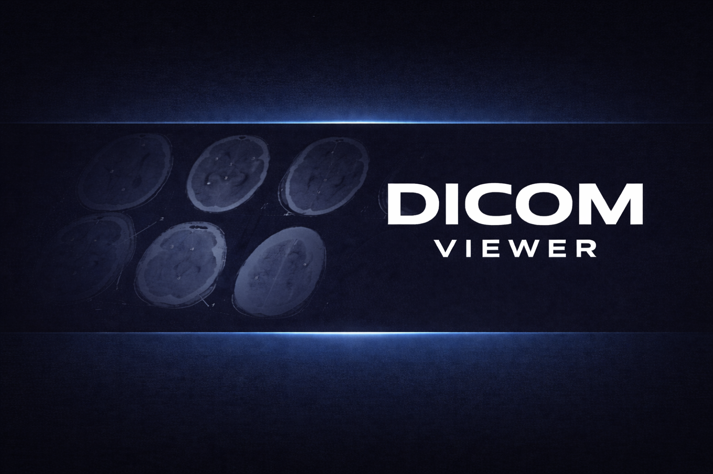

# DICOM Viewer

A desktop DICOM medical image viewer built with C++17, Qt 6, and DCMTK.



## Features

### Image Display
- Load and display DICOM (.dcm) medical image files
- Support for grayscale (MONOCHROME1, MONOCHROME2) and RGB images
- GPU-accelerated rendering via OpenGL with automatic CPU fallback
- Thumbnail view for browsing multiple loaded images

### Window/Level Adjustment
- Mouse drag adjustment (horizontal = width/contrast, vertical = center/brightness)
- Interactive sliders in the HUD panel
- Reset to DICOM default values

### View Controls
- **Zoom**: In/out, fit to window, actual size (1:1)
- **Rotation**: Rotate left/right (90° increments)
- **Pan**: Drag to pan when zoomed in

### Color Palettes
- Grayscale (default)
- Inverted
- Hot (thermal)
- Cool (blue tones)
- Rainbow
- Bone
- Copper
- Ocean

### Export & Reports
- Export images to PNG, JPEG, or PDF
- Generate PDF diagnostic reports with metadata

### Metadata
- Display DICOM tags in a searchable panel
- Patient, study, series, and image information

## Presentation Video

Watch the project presentation directly here:

<video controls width="800">
  <source src="https://raw.githubusercontent.com/adrielvasques/dicom-viewer-app/main/docs/presentation.mp4" type="video/mp4">
</video>

YouTube fallback: https://www.youtube.com/watch?v=2MJS51JaBLg

## Rendering

The application uses **OpenGL** for hardware-accelerated image rendering with real-time window/level adjustments and color palette application via GPU shaders.

For systems without OpenGL 3.3+ support, the application automatically falls back to **CPU-based rendering** using Qt's software rasterizer.

## Quick Setup

Use the automated setup script to install dependencies and build:

```bash
chmod +x setup.sh
./setup.sh
```

The script supports Ubuntu/Debian, Fedora, Arch Linux, openSUSE, and macOS.

## Dependencies

| Dependency | Version | Purpose |
|------------|---------|---------|
| Qt 6 | 6.2+ | GUI framework |
| Qt SVG | 6.2+ | SVG icon support |
| Qt OpenGL | 6.2+ | GPU rendering |
| DCMTK | 3.6+ | DICOM file parsing |
| CMake | 3.16+ | Build system |
| C++ Compiler | C++17 | GCC 9+, Clang 10+, MSVC 2019+ |

### Ubuntu/Debian

```bash
sudo apt install \
    build-essential \
    cmake \
    qt6-base-dev \
    qt6-svg-dev \
    libqt6opengl6-dev \
    libgl1-mesa-dev \
    libdcmtk-dev \
    libdcmtk17
```

### Fedora

```bash
sudo dnf install \
    gcc-c++ \
    cmake \
    qt6-qtbase-devel \
    qt6-qtsvg-devel \
    mesa-libGL-devel \
    dcmtk-devel
```

### Arch Linux

```bash
sudo pacman -S --needed \
    base-devel \
    cmake \
    qt6-base \
    qt6-svg \
    mesa \
    dcmtk
```

### openSUSE

```bash
sudo zypper install \
    gcc-c++ \
    cmake \
    qt6-base-devel \
    qt6-svg-devel \
    Mesa-libGL-devel \
    dcmtk-devel
```

### macOS (Homebrew)

```bash
brew install cmake qt@6 dcmtk
# Qt6 includes SVG and OpenGL support by default
```

### Windows

Download and install:
- [Qt 6](https://www.qt.io/download-qt-installer) (with SVG and OpenGL modules)
- [DCMTK](https://dicom.offis.de/dcmtk.php.en)
- [CMake](https://cmake.org/download/)

## Building

```bash
# Configure
cmake -B build -S .

# Build
cmake --build build

# Run
./build/dicom-visualizer
```

## Usage

1. Launch the application
2. Use **File > Open** or drag-and-drop DICOM files
3. Adjust contrast/brightness by dragging on the image
4. Use the HUD controls on the right side for view adjustments
5. View metadata in the left panel

### Keyboard Shortcuts

| Key | Action |
|-----|--------|
| `Ctrl+O` | Open file |
| `R` | Reset window/level |
| `+` / `-` | Zoom in/out |
| `0` | Fit to window |
| `1` | Actual size |

### HUD Controls

| Icon | Action |
|------|--------|
| 🔍+ | Zoom in |
| 🔍- | Zoom out |
| ⛶ | Fit to window |
| 1:1 | Actual size |
| ↺ | Rotate left |
| ↻ | Rotate right |
| ◐ | Color palette selector |
| ⟲ | Reset all |

## Project Structure

```
dicom-visualizer/
├── CMakeLists.txt
├── include/DicomViewer/
│   ├── Types.h           # Shared types and constants
│   └── Debug.h           # Debug logging utilities
├── resources/
│   ├── resources.qrc     # Qt resource file
│   ├── clean-medical.qss # Application stylesheet
│   ├── icons/            # SVG icons
│   └── images/           # Application images
└── src/
    ├── main.cpp          # Entry point with splash screen
    ├── application/
    │   ├── ports/         # Interfaces (ports)
    │   └── dto/           # Data transfer objects
    ├── core/
    │   ├── CDicomLoader  # DICOM file loading (DCMTK)
    │   ├── CDicomImage   # Image data container
    │   └── CDicomMetadata# Metadata storage
    ├── infrastructure/
    │   ├── dcmtk/         # DCMTK adapters
    │   └── qt/            # Qt adapters (rendering/report)
    ├── presentation/
    │   └── viewmodels/    # MVVM ViewModels
    ├── ui/
    │   ├── CMainWindow   # Main application window
    │   ├── CImageViewer  # OpenGL image display with HUD
    │   ├── CMetadataPanel# Metadata table widget
    │   └── CThumbnailWidget # Thumbnail browser
    └── utils/
        ├── CImageConverter # DICOM to QImage conversion
        └── CColorPalette   # Color LUT definitions
```

## License

This project was created as a technical demonstration.

## Mapped issues

- The operating system theme can influence the application's overall appearance, and this has not been fully handled yet. If you notice visual differences, consider using the system default theme.
